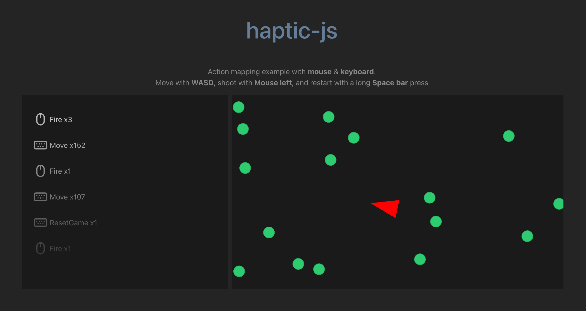

# haptic-js

Input & action mapping library for JavaScript.

> 🚧 haptic-js is released as a beta until the API is stabilized 🚧

**Features**:

* Supported devices:
    * ⌨️ Keyboard
    * 🖱 Mouse
    * 🎮 XR Gamepad (MetaQuest, etc..)
* Interactions:
    * Down: Triggered **each frame** until released
    * Press: Triggered **once** upon press
    * LongPress: Triggered **once** after a time threshold

Getting started:

* [Documentation](./DOC.md)
* [Example](./example/src/index.ts)

## Install

Using `npm`:

```sh
npm i haptic-js
```

Using `yarn`:

```sh
yarn add haptic-js
```

## Usage Example

```js
import {
    BooleanAction,
    Axis2dAction,
    ActionManager,
    BooleanMapping,
    EmulatedAxis2dMapping,
    MouseInputSource,
    XRGamepadInputSource,
    Handedness,
} from 'haptic-js';

// Player performs a fire action.
const fire = new BooleanAction();
// Player performs a move action (forward / backward / left / right).
const move = new Axis2dAction();

// Create devices: One mouse and two gamepads (one per controller).
const mouse = new MouseInputSource('mouse');
const rightGamepad = new XRGamepadInputSource('right', Handedness.Right);
const leftGamepad = new XRGamepadInputSource('left', Handedness.Left);

const manager = new ActionManager();

// Player can fire either with the mouse, or the right controller.
manager.add(fire, [
    new BooleanMapping(mouseInput, MouseBinding.Primary),
    new BooleanMapping(rightGamepad, XRButtonBinding.Trigger),
]);

manager.add(move, [
    // WASD mapping to the value: [-1; 1].
    new EmulatedAxis2dMapping(keyboardInput, {
        maxY: KeyboardBinding.KeyW,
        minX: KeyboardBinding.KeyA,
        minY: KeyboardBinding.KeyS,
        maxX: KeyboardBinding.KeyD,
    }),
    // Player moves with the left controller joystick.
    new Axis2dMapping(leftGamepad, XRAxisBinding.Joystick)
]);

// This event is triggered when a match for any of the mapping occurs.
fire.completed.add(() => console.log('Pew!'));
```

## Example



The repository comes with a small [example](example) demonstrating how to use the library.

## ToDo

* [ ] Serialization & Deserialization of the action manager state
* [ ] Touch support

## Attributions

* Thanks to Dazzle UI for the [SVG icons](https://www.svgrepo.com/svg/533083/keyboard) used in the example.
